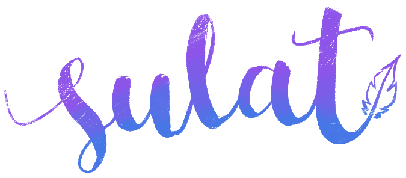

> **ATTENTION**: This is currently in development. Please wait for the stable release.

<h1 style="text-align:center;">
    
    <small><b>Version 0.1.0-alpha</b></small>
</h1>
<p style="text-align:center;">
Super simple platform-agnostic headless CMS made for you.
<br/>
<br/>
Sulat was built to adapt to the demands of the user and to any kind of SSG's (Static Site Generator) with it's extensibility built in mind.
<br/>
It's name was originated from the Filipino word meaning "to write".
</p>

## Features
1. ~~**Extensible** - Want to use Gitlab as gateway? Add a custom shortcode/widget? You can make a plugin for it. Sulat uses [pluggable.js](https://github.com/conversejs/pluggablejs) to make Sulat your own CMS.~~
2. **Dead simple** - The interface doesn't have any additional steps to do what's supposed to do. Pick an article or create a new one with a click and start writing.
3. **Powered by [Mithril](https://mithril.js.org)** - A tiny, complete out-of-the box Javascript library makes Sulat slim and fast.

To start:

```bash
$ npm install
```

To develop:

```bash
$ npm run dev
```

To build for production:

```bash
$ npm run build
```

---

&copy; 2018 [nedpals](https://github.com/nedpals).
